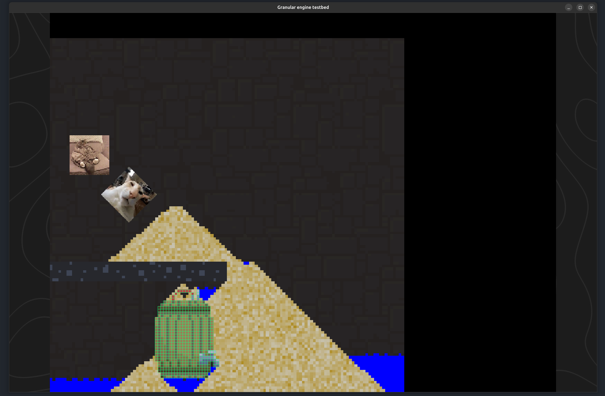
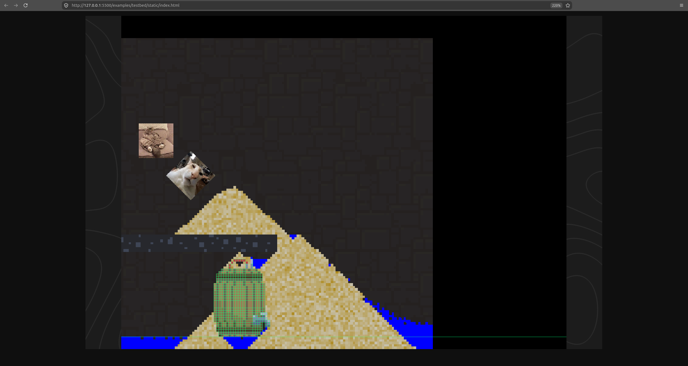
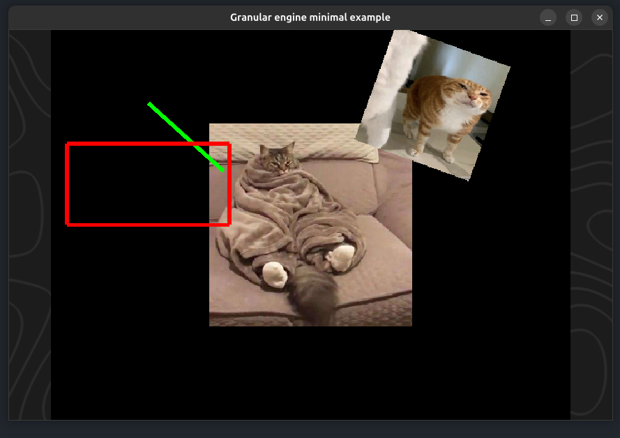

# Custom GPU accelerated falling sand engine

This is a small 2D game engine written in Rust and `wgpu`. It provides a 2D Quad-Batchrenderer as well as some input-/ window-/ asset-management.
The main goal is to support 2D applications which want to integrate a [falling sand simulation](https://en.wikipedia.org/wiki/Falling-sand_game).

It runs on native and WASM with almost no changes needed on the users-side.

<figure>
  <p align="center">
    
    
  </p>
  <figcaption style="text-align: center">granular testbed running on native (Linux; left) and on WASM (Firefox; right)</figcaption>
</figure> 

## Examples
A minimal example can be found in [examples/minimal](examples/minimal). Here is the most important part (from [lib.rs](examples/minimal/src/lib.rs)):

```rust
/// Wasm entrypoint
#[cfg(target_arch = "wasm32")]
#[wasm_bindgen(start)]
pub fn run_wasm() -> Result<(), wasm_bindgen::JsValue> {
    console_error_panic_hook::set_once();

    run();
    Ok(())
}

/// Real entry point of the program no matter if being run via WASM or native
pub fn run() {
    set_up_logging();
    let engine = GranularEngine::<Game>::new(uvec2(640, 480));
    engine.run();
}

#[derive(Debug)]
struct Game {
    ctx: GeeseContextHandle<Self>,

    texture_handle: AssetHandle<TextureBundle>,
    texture2_handle: AssetHandle<TextureBundle>,
}
impl Game {
    // Called when everything in the engine is ready
    fn init(&mut self, _event: &events::Initialized) {
        {
            let mut camera = self.ctx.get_mut::<Camera>();
            camera.set_motion(CameraMotion::SmoothPixel);
            camera.set_scaling_mode(ScalingMode::KeepAspect);
        }
    }

    fn on_update(&mut self, _: &events::timing::FixedTick<16>) {
        let input = self.ctx.get::<InputSystem>();
        // Gets a 2D vector where the x component is -1 if the cam_left action is pressed, 1 if cam_right is pressed and 0 otherwise. Same for y component
        let vector = input.world_input_direction("cam_left", "cam_right", "cam_up", "cam_down");
        drop(input);
        let mut camera = self.ctx.get_mut::<Camera>();
        // Move the camera using the preconfigured input actions
        camera.translate(vector * 10.0);
    }

    fn on_draw(&mut self, _: &granular::graphics::events::RecordGameRenderingCommands) {
        let mut batchrenderer = self.ctx.get_mut::<BatchRenderer>();
        batchrenderer.draw_quad_with_center(
            vec2(0.0, 0.0),
            vec2(250.0, 250.0),
            0.0,
            palette::named::WHITE,
            QuadTex::Texture(self.texture_handle.clone()),
            0,
            DrawSpace::World,
        );
        batchrenderer.draw_quad_with_bottomleft(
            vec2(75.0, 75.0),
            vec2(150.0, 150.0),
            -20.0f32.to_radians(),
            palette::named::WHITE,
            QuadTex::Texture(self.texture2_handle.clone()),
            1,
            DrawSpace::World,
        );
        drop(batchrenderer);
        let time = self.ctx.get::<TimeSystem>().time_since_start();
        let time_secs = time.as_secs_f32();
        let mut debug_draw = self.ctx.get_mut::<DebugDraw>();
        let start = vec2(-200.0, 150.0);
        let end = start + vec2(time_secs.sin(), time_secs.cos()) * 125.0;
        debug_draw.draw_line(start, end, palette::named::LIME, 5.0, 1, DrawSpace::World);

        debug_draw.draw_rect_center(
            vec2(-200.0, 50.0),
            vec2(200.0, 100.0),
            0.0,
            palette::named::RED,
            5.0,
            2,
            DrawSpace::World,
        );
    }
}
impl GeeseSystem for Game {
    // Register our functions to be called from the engine on certain events.
    // The name of those functions is decided by the user
    const EVENT_HANDLERS: EventHandlers<Self> = event_handlers()
        .with(Self::init)
        .with(Self::on_update)
        .with(Self::on_draw);

    // Tell the engine which systems the game needs access to
    const DEPENDENCIES: Dependencies = dependencies()
        .with::<Mut<WindowSystem>>()
        .with::<Mut<InputSystem>>()
        .with::<Mut<Camera>>()
        .with::<Mut<GraphicsSystem>>()
        .with::<Mut<DebugDraw>>()
        .with::<TimeSystem>()
        .with::<Mut<AssetSystem>>()
        .with::<Mut<BatchRenderer>>();

    // Called when the game system gets instantiated (but not everything might be ready yet)
    fn new(mut ctx: GeeseContextHandle<Self>) -> Self {
        info!("Game created");

        // Register arrow keys to use as camera movement
        {
            let mut input = ctx.get_mut::<InputSystem>();
            input.add_action(
                "cam_left",
                InputActionTrigger::new_key(KeyCode::ArrowLeft, ModifiersState::empty()),
            );
            input.add_action(
                "cam_right",
                InputActionTrigger::new_key(KeyCode::ArrowRight, ModifiersState::empty()),
            );
            input.add_action(
                "cam_up",
                InputActionTrigger::new_key(KeyCode::ArrowUp, ModifiersState::empty()),
            );
            input.add_action(
                "cam_down",
                InputActionTrigger::new_key(KeyCode::ArrowDown, ModifiersState::empty()),
            );
        }

        // Load two images
        let (texture_handle, texture2_handle) = {
            let mut asset_sys = ctx.get_mut::<AssetSystem>();
            let texture_handle = asset_sys
                .load(
                    asset_source!("../../assets/cat2.jpg"),
                    TextureBundleLoadSettings {
                        name: String::from("cat"),
                        ..Default::default()
                    },
                )
                .unwrap();
            let texture2_handle = asset_sys
                .load(
                    asset_source!("../../assets/cat3.jpg"),
                    TextureBundleLoadSettings::default(),
                )
                .unwrap();
            (texture_handle, texture2_handle)
        };

        // Configure the window
        {
            let mut win_sys = ctx.get_mut::<WindowSystem>();
            win_sys.set_window_size(winit::dpi::PhysicalSize::new(865, 559));
            win_sys.set_title("Granular engine minimal example");
        }

        Self {
            ctx,
            texture_handle,
            texture2_handle,
        }
    }
}

fn set_up_logging() {
  ...
}
```

<figure>
  <p align="center">
    
  </p>
  <figcaption style="text-align: center">Output of the minimal example on native</figcaption>
</figure> 


## Running on WASM
> [!NOTE]
> This example uses `wasm-pack` which can be installed via:
> ```
> cargo install wasm-pack
> ```
> But I am sure experienced users can make it work without `wasm-pack`.

#### Building once

```
wasm-pack build examples/testbed --target web --dev
```
(Replace `testbed` with `minimal` if you want to run the minimal example instead. For release, omit the `--dev`)

#### Viewing it
Open the `examples/testbed/static/index.html` with some web server. I use the [Live Server (Five Server) VSCode extension](https://marketplace.visualstudio.com/items?itemName=yandeu.five-server) but you can use whatever webserver you want. Without the webserver, the page might not load correctly because of CORS-policies.

#### Building continously
Using `cargo watch` (to install, run `cargo install cargo-watch`)

```
cargo watch -s "wasm-pack build examples/testbed --target web --dev"
```
(Replace `testbed` with `minimal` if you want to run the minimal example instead. )

## Running natively
```
cargo run -p testbed
```
(Replace `testbed` with `minimal` if you want to run the minimal example instead. )

## Running with profiling
```
cargo run-testbed-trace
```
(Uses an alias defined in `.cargo/config.toml`)


## Todo
- ✅ Done: Make user provide cell logic (easy)
- ✅ Done: Test simulation shader hot reloading
- ✅ Done: Store colors inside cell
- Find way to remove GraphicsSystem dependency from Game?
- Write some usage information (simulation setup + requirements)
- Maybe provide a working webpage with the testbed running?
- What about camera zoom < 0?
- Is Rigidbody collision shape enlargement neccessary?
- Create Rigidbodies from data images (with different materials). Maybe have a HashMap of pixel color -> MatName, or just use the pixel color value as index into matname
- Make letterbox background shader user-provided

**Low priority:**
- Dynamically remove textures from `BatchRenderer` texture atlasses
- Input system: What about touch gestures?

